# 🌿 EcoTrack Mobile


**EcoTrack** (GrabTrash) is a modern Android mobile application designed to revolutionize waste management by connecting users with trash pickup services. Schedule pickups, track your orders, and contribute to a cleaner environment!

---

## 📑 Table of Contents

- [Features](#-features)
- [Tech Stack](#️-tech-stack)
- [Getting Started](#-getting-started)
  - [Prerequisites](#prerequisites)
  - [Installation](#installation)
  - [Firebase Setup](#firebase-setup)
  - [OpenStreetMap Setup](#openstreetmap-setup)
- [Project Structure](#-project-structure)
- [App Architecture](#️-app-architecture)
- [API Documentation](#-api-documentation)
- [Testing](#-testing)
- [Contributing](#-contributing)
- [Team](#-team)
- [License](#-license)

---

## ✨ Features

### 👤 For Users
| Feature | Description |
|---------|-------------|
| **User Authentication** | Secure login/registration |
| **Security Questions** | Password recovery through security questions |
| **Order Trash Pickup** | Schedule pickups with interactive map location selection |
| **Multiple Payments** | Pay via GCash or Cash on Hand (Xendit integration) |
| **Order History** | View past orders and download receipts |
| **Push Notifications** | FCM-powered notifications for order updates |
| **Profile Management** | Edit profile, change password, manage settings |
| **Collection Schedule** | View scheduled garbage collection calendar |
| **Cloud Storage** | FileLu integration for file uploads and management |

### 🚛 For Drivers
| Feature | Description |
|---------|-------------|
| **Driver Dashboard** | View and manage assigned job orders |
| **Interactive Maps** | Navigation with collection point locations |
| **Job Status Updates** | Update order status (Accept, In-Progress, Complete, Cancelled) |
| **Order History** | View completed and cancelled job orders |
| **Profile Management** | Manage driver profile and settings |
| **Delivery History** | Track all past deliveries and pickups |

---

## 🛠️ Tech Stack

### Core Technologies
| Category | Technologies |
|----------|-------------|
| **Language** | Kotlin 1.9.x |
| **Min SDK** | API 24 (Android 7.0 Nougat) |
| **Target SDK** | API 34 (Android 14) |
| **UI Framework** | Jetpack Compose + XML Views (Hybrid) |
| **Architecture** | MVVM with ViewBinding |

### Services
| Service | Purpose |
|---------|---------|
| **Firebase Auth** | User authentication |
| **Firebase Firestore** |  Database |
| **Firebase Cloud Messaging** | Push notifications |
| **Xendit** | Payment processing (GCash) |
| **FileLu API** | Cloud file storage |

### Libraries & Dependencies
| Library | Version | Purpose |
|---------|---------|---------|
| Jetpack Compose BOM | 2024.02.00 | Modern UI toolkit |
| OSMDroid | 6.1.16 | OpenStreetMap integration |
| Retrofit | 2.9.0 | HTTP client |
| OkHttp | 4.9.0 | Network layer |
| Glide | 4.16.0 | Image loading |
| Coroutines | 1.7.3 | Async operations |
| BCrypt | 0.10.2 | Password hashing |
| kizitonwose/Calendar | 2.5.1 | Calendar view |

---

## 🚀 Getting Started

### Prerequisites

Before you begin, ensure you have the following installed:

- **Android Studio** Hedgehog (2023.1.1) or newer
  - Download from [developer.android.com](https://developer.android.com/studio)
- **JDK 8** or higher
- **Git** for version control
- **A physical Android device or emulator** (API 24+)

### Installation

1. **Clone the repository**
   ```bash
   git clone https://github.com/MarckRamon/EcoTrack-Mobile.git
   cd EcoTrack-Mobile
   ```

2. **Open in Android Studio**
   - Launch Android Studio
   - Select **File → Open**
   - Navigate to the cloned directory and select it
   - Wait for Gradle sync to complete

3. **Create `local.properties`** (if not exists)
   ```properties
   sdk.dir=C:\\Users\\YOUR_USERNAME\\AppData\\Local\\Android\\Sdk
   ```

### Firebase Setup

1. **Create a Firebase Project**
   - Go to [Firebase Console](https://console.firebase.google.com/)
   - Click "Add project" and follow the wizard
   - Enter project name: `EcoTrack` or similar

2. **Add Android App**
   - Click "Add app" → Select Android
   - Package name: `com.example.grabtrash`
   - App nickname: `EcoTrack Mobile`
   - Register the app

3. **Download Configuration**
   - Download `google-services.json`
   - Place it in the `app/` directory

4. **Enable Firebase Services**

   In Firebase Console, enable the following:

   | Service | Settings |
   |---------|----------|
   | **Authentication** | Enable Email/Password sign-in |
   | **Cloud Firestore** | Create database in production/test mode |
   | **Cloud Messaging** | Enable for push notifications |

5. **Firestore Security Rules** (Development)
   ```javascript
   rules_version = '2';
   service cloud.firestore {
     match /databases/{database}/documents {
       match /{document=**} {
         allow read, write: if request.auth != null;
       }
     }
   }
   ```

### OpenStreetMap Setup

This project uses **OpenStreetMap** via the **OSMDroid** library. No API key is required!

1. **Permissions**

   The following permissions are already configured in `AndroidManifest.xml`:
   ```xml
   <uses-permission android:name="android.permission.INTERNET" />
   <uses-permission android:name="android.permission.ACCESS_FINE_LOCATION" />
   <uses-permission android:name="android.permission.ACCESS_COARSE_LOCATION" />
   <uses-permission android:name="android.permission.WRITE_EXTERNAL_STORAGE" android:maxSdkVersion="28" />
   ```

2. **Configuration**

   OSMDroid is configured in the app with:
   - Tile caching for offline support
   - Custom user agent for API compliance
   - Location services integration

3. **Usage**

   The map is used in:
   - `MapActivity.kt` - Location selection for pickups
   - `DriverMapActivity.kt` - Driver navigation
   - `PrivateEntityMapActivity.kt` - Entity location management

> 💡 **Note**: OpenStreetMap is free and open-source. No billing setup required!

### Build and Run

```bash
# Build debug APK
./gradlew assembleDebug

# Install on connected device
./gradlew installDebug

# Or simply click the Run ▶️ button in Android Studio
```

---

## 📂 Project Structure

```
EcoTrack-Mobile/
├── app/
│   ├── src/main/
│   │   ├── java/com/example/grabtrash/
│   │   │   ├── LoginActivity.kt           # User login
│   │   │   ├── RegisterActivity.kt        # User registration
│   │   │   ├── HomeActivity.kt            # Main home screen
│   │   │   ├── ProfileActivity.kt         # User profile
│   │   │   ├── ScheduleActivity.kt        # Collection schedule
│   │   │   ├── DriverLoginActivity.kt     # Driver authentication
│   │   │   ├── DriverHomeActivity.kt      # Driver dashboard
│   │   │   ├── DriverMapActivity.kt       # Driver navigation
│   │   │   ├── DriverJobOrderActivity.kt  # Job order management
│   │   │   ├── ui/pickup/
│   │   │   │   ├── OrderPickupActivity.kt     # Order creation
│   │   │   │   ├── MapPickerActivity.kt       # Location selection
│   │   │   │   ├── PaymentMethodActivity.kt   # Payment selection
│   │   │   │   ├── OrderSuccessActivity.kt    # Success screen
│   │   │   │   ├── OrderStatusActivity.kt     # Order tracking
│   │   │   │   ├── OrderReceiptActivity.kt    # Receipt display
│   │   │   │   └── model/
│   │   │   │       ├── PickupOrder.kt         # Order data model
│   │   │   │       └── PaymentMethod.kt       # Payment enum
│   │   │   ├── utils/
│   │   │   │   ├── FileLuService.kt           # Cloud storage API
│   │   │   │   └── EcoTrackFirebaseMessagingService.kt
│   │   │   └── models/
│   │   │       └── FileLuModels.kt            # FileLu data models
│   │   └── res/
│   │       ├── layout/           # XML layouts
│   │       ├── drawable/         # Icons, graphics, backgrounds
│   │       ├── values/           # Strings, colors, dimensions
│   │       ├── values-night/     # Dark theme resources
│   │       └── xml/              # Configurations
│   ├── build.gradle.kts          # App-level build config
│   └── google-services.json      # Firebase config (gitignored)
├── gradle/                       # Gradle wrapper
├── build.gradle.kts              # Project-level build config
├── settings.gradle.kts           # Project settings
└── README.md                     # This file
```

---

## 🏗️ App Architecture

The app follows the **MVVM (Model-View-ViewModel)** architecture pattern:

```mermaid
flowchart TB
    subgraph UI["🖥️ UI Layer"]
        direction LR
        Activities["📱 Activities<br/>(XML)"]
        Fragments["🧩 Fragments<br/>(XML)"]
        Compose["⚡ Jetpack Compose<br/>Screens"]
    end

    subgraph VM["⚙️ ViewModel Layer"]
        ViewModels["ViewModels with LiveData / StateFlow"]
    end

    subgraph Data["💾 Data Layer"]
        direction LR
        Firestore["🔥 Firebase<br/>Firestore"]
        Retrofit["🌐 Retrofit<br/>(REST API)"]
        LocalStorage["📦 Local Storage<br/>SharedPrefs"]
    end

    subgraph External["☁️ External Services"]
        direction LR
        Auth["🔐 Firebase<br/>Auth"]
        FCM["📨 FCM"]
        Xendit["💳 Xendit"]
        OSM["🗺️ OSM"]
        FileLu["📁 FileLu"]
    end

    Activities --> ViewModels
    Fragments --> ViewModels
    Compose --> ViewModels
    ViewModels --> Firestore
    ViewModels --> Retrofit
    ViewModels --> LocalStorage
    Firestore --> Auth
    Firestore --> FCM
    Retrofit --> Xendit
    Retrofit --> FileLu
    LocalStorage --> OSM
```



### Navigation Flow

```mermaid
flowchart TD
    Login["🔐 Login Screen"]
    UserType{"👤 User Type?"}
    
    Login --> UserType
    
    UserType -->|"Regular User"| UserHome["🏠 User Home"]
    UserType -->|"Driver"| DriverHome["🚛 Driver Home"]
    UserType -->|"Private Entity"| EntityHome["🏢 Entity Home"]
    
    subgraph UserFlow["👤 User Flow"]
        UserHome --> OrderPickup["📦 Order Pickup"]
        UserHome --> Schedule["📅 Schedule"]
        UserHome --> Profile["👤 Profile"]
        UserHome --> Notifications["🔔 Notifications"]
        UserHome --> MapPicker["🗺️ Map View"]

        OrderPickup --> Payment["💳 Payment"]
        Payment --> OrderSuccess["✅ Order Success"]
        OrderSuccess --> OrderStatus["📊 Order Status"]
    end
    
    subgraph DriverFlow["🚛 Driver Flow"]
        DriverHome --> AvailableOrders["📋 Available Orders"]
        DriverHome --> DriverMap["🗺️ Driver Map"]
        DriverHome --> CompletedOrders["✅ Completed Orders"]
        DriverHome --> DriverProfile["👤 Driver Profile"]
        
        AvailableOrders --> JobOrder["📝 Job Order Details"]
        JobOrder --> |"Accept"| ActiveJob["🔄 Active Job"]
        ActiveJob --> |"Complete"| CompletedOrders
    end
```



---

## 📖 API Documentation

### Internal Documentation

| Document | Description |
|----------|-------------|
| [Implementation Manifest](implementation_manifest.md) | Detailed screen-by-screen implementation guide |
| [FileLu Integration](FileLu_Integration_README.md) | Cloud storage API integration guide |

### External Services

| Service | Documentation |
|---------|---------------|
| **Firebase** | [Firebase Android Docs](https://firebase.google.com/docs/android/setup) |
| **OpenStreetMap** | [OSMDroid Wiki](https://github.com/osmdroid/osmdroid/wiki) |
| **Xendit** | [Xendit API Docs](https://developers.xendit.co/api-reference) |
| **FileLu** | [FileLu API Reference](https://filelu.com/pages/api/) |

### Key API Endpoints (Backend)

For backend developers implementing the server:

```
POST   /api/orders              # Create pickup order
GET    /api/orders/:id          # Get order details
PUT    /api/orders/:id/status   # Update order status
GET    /api/orders/user/:userId # Get user's orders

POST   /api/payments/create     # Initialize payment
POST   /api/payments/verify     # Verify payment status

GET    /api/schedule            # Get collection schedule
```

---

## 🧪 Testing

### Running Tests

```bash
# Run unit tests
./gradlew test

# Run instrumented tests
./gradlew connectedAndroidTest

# Run all tests with coverage
./gradlew testDebugUnitTestCoverage
```

### Test Structure

```
app/src/
├── test/                    # Unit tests
│   └── java/com/example/grabtrash/
│       └── utils/
│           └── FileLuServiceTest.kt
└── androidTest/             # Instrumented tests
    └── java/com/example/grabtrash/
        └── ExampleInstrumentedTest.kt
```

---

## 🤝 Contributing

We welcome contributions! Please follow these steps:

### Getting Started

1. **Fork the repository**
2. **Clone your fork**
   ```bash
   git clone https://github.com/YOUR_USERNAME/EcoTrack-Mobile.git
   ```
3. **Create a feature branch**
   ```bash
   git checkout -b feature/amazing-feature
   ```
4. **Make your changes**
5. **Commit with a descriptive message**
   ```bash
   git commit -m "feat: add amazing feature"
   ```
6. **Push to your branch**
   ```bash
   git push origin feature/amazing-feature
   ```
7. **Open a Pull Request**

### Commit Convention

We follow [Conventional Commits](https://www.conventionalcommits.org/):

| Type | Description |
|------|-------------|
| `feat` | New feature |
| `fix` | Bug fix |
| `docs` | Documentation only |
| `style` | Code style changes |
| `refactor` | Code refactoring |
| `test` | Adding tests |
| `chore` | Maintenance tasks |

### Code Style

- Follow [Kotlin Coding Conventions](https://kotlinlang.org/docs/coding-conventions.html)
- Use meaningful variable and function names
- Add KDoc comments for public APIs
- Keep functions small and focused

---

## 👥 Team

<table>
  <tr>
    <td align="center">
      <a href="https://github.com/MarckRamon">
        <br />
        <sub><b>Marck Ramon</b></sub>
      </a><br />
      <sub>Lead Developer</sub>
    </td>
    <td align="center">
      <a href="https://github.com/MykelSeth">
        <br />
        <sub><b>Mykel Seth</b></sub>
      </a><br />
      <sub>Lead Developer</sub>
    </td>
  </tr>
</table>

### Contributors

Thanks to everyone who has contributed to this project!

---

## 📄 License

This project is licensed under the **MIT License** - see the [LICENSE](LICENSE) file for details.

```
MIT License

Copyright (c) 2024 EcoTrack Team

Permission is hereby granted, free of charge, to any person obtaining a copy
of this software and associated documentation files (the "Software"), to deal
in the Software without restriction, including without limitation the rights
to use, copy, modify, merge, publish, distribute, sublicense, and/or sell
copies of the Software, and to permit persons to whom the Software is
furnished to do so, subject to the following conditions:

The above copyright notice and this permission notice shall be included in all
copies or substantial portions of the Software.

THE SOFTWARE IS PROVIDED "AS IS", WITHOUT WARRANTY OF ANY KIND, EXPRESS OR
IMPLIED, INCLUDING BUT NOT LIMITED TO THE WARRANTIES OF MERCHANTABILITY,
FITNESS FOR A PARTICULAR PURPOSE AND NONINFRINGEMENT. IN NO EVENT SHALL THE
AUTHORS OR COPYRIGHT HOLDERS BE LIABLE FOR ANY CLAIM, DAMAGES OR OTHER
LIABILITY, WHETHER IN AN ACTION OF CONTRACT, TORT OR OTHERWISE, ARISING FROM,
OUT OF OR IN CONNECTION WITH THE SOFTWARE OR THE USE OR OTHER DEALINGS IN THE
SOFTWARE.
```

---

## 🙏 Acknowledgments

- [Firebase](https://firebase.google.com/) for backend services
- [OpenStreetMap](https://www.openstreetmap.org/) for free and open map data
- [OSMDroid](https://github.com/osmdroid/osmdroid) for the Android map library
- [Xendit](https://www.xendit.co/) for payment processing
- [FileLu](https://filelu.com/) for cloud storage
- All the amazing open-source libraries that made this project possible

---

## 📞 Support

Having issues? Here's how to get help:

1. **Check the [Issues](https://github.com/MarckRamon/EcoTrack-Mobile/issues)** for known problems
2. **Open a new issue** with detailed information
3. **Contact the team** via the repository discussions

---

<p align="center">
  
  <br/>
  <b>EcoTrack Mobile</b>
  <br/>
  Made with 💚 for a cleaner environment
  <br/><br/>
  ⭐ Star us on GitHub if this project helped you!
</p>